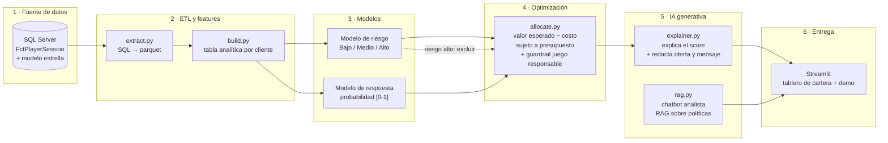

# Identificación de riesgos y optimización de recompensas — Casino Palacio Real

> Proyecto Integrador · Diploma AI Engineer (DMC Institute) · 2026
> Caso de estudio con datos **simulados**.

Solución basada en **Machine Learning e IA generativa** que identifica el **nivel de
riesgo** de cada cliente y estima su **probabilidad de respuesta** a una recompensa,
para **optimizar la asignación del presupuesto promocional** de Casino Palacio Real,
respetando salvaguardas de **juego responsable**.

## Objetivo (SMART)

Desarrollar, sobre el histórico de sesiones de juego, un sistema que asigne a cada
cliente un nivel de riesgo (Bajo/Medio/Alto) y una probabilidad de respuesta [0–1],
y que a partir de ambos proponga una recompensa por cliente maximizando el retorno
esperado de la campaña sujeto a un presupuesto, superando en retorno esperado a la
asignación por reglas actual.

## Bloques del diploma integrados

| Bloque | Cómo se usa en el proyecto |
|---|---|
| **Recomendación adaptativa / agentes** | Modelos de riesgo y de propensión + optimizador de asignación de recompensas (ranking por valor esperado / knapsack; extensible a *contextual bandits*). |
| **IA generativa (texto)** | Capa LLM que explica los scores en lenguaje natural y redacta la oferta y el mensaje personalizado por cliente. |
| **Chatbot RAG** | Asistente para el analista con RAG sobre la política de recompensas y el protocolo de juego responsable (`rag/politicas/`). |
| Microsoft Azure | *Trabajo futuro* — despliegue en Azure Container Apps + Azure OpenAI + Blob Storage. Documentado en [`docs/arquitectura.md`](docs/arquitectura.md). |

## Arquitectura



Detalle completo (componentes, decisiones, alternativas, plan Azure) en
[`docs/arquitectura.md`](docs/arquitectura.md).

## Estructura del repositorio

```
.
├── sql/                  Scripts de base de datos (cargar, dimensiones, features)
├── data/
│   ├── raw/              CSV simulado de sesiones (fuente)
│   ├── interim/          extracciones intermedias (git-ignored)
│   └── processed/        tabla analítica lista para modelar (git-ignored)
├── src/casino_ia/
│   ├── config.py         configuración central (lee .env)
│   ├── data/extract.py   extracción desde SQL Server
│   ├── features/build.py construcción de la tabla analítica por cliente
│   ├── models/risk.py    modelo de nivel de riesgo
│   ├── models/response.py modelo de probabilidad de respuesta
│   ├── optimization/allocate.py  asignación óptima de recompensas
│   ├── genai/explainer.py capa LLM: explicación + generación de oferta
│   ├── genai/rag.py      chatbot RAG para el analista
│   └── app/streamlit_app.py  tablero y demo
├── scripts/              puntos de entrada: EDA, entrenamiento, asignación
├── notebooks/            01_eda.ipynb
├── rag/politicas/        documentos de política (base de conocimiento del RAG)
├── tests/                pruebas de features y de la asignación
└── reports/              figuras y métricas generadas
```

## Puesta en marcha (< 10 min)

Requisitos: Python 3.11+, SQL Server 2022 con la base `CasinoPalacioReal` cargada
(ver [`sql/README.md`](sql/README.md)), *ODBC Driver 17 for SQL Server*.

```bash
git clone https://github.com/milagrossanchez/proyecto-integrador-ai-engineer.git
cd proyecto-integrador-ai-engineer

python -m venv .venv
# Windows:  .venv\Scripts\activate
# Linux/Mac: source .venv/bin/activate
pip install -r requirements.txt

cp .env.example .env          # y completar credenciales

# 1) EDA
python scripts/run_eda.py
# 2) Entrenar modelos de riesgo y respuesta
python scripts/train_models.py
# 3) Asignación óptima de recompensas para un presupuesto dado
python scripts/run_allocation.py --presupuesto 15000
# 4) Demo interactiva
streamlit run src/casino_ia/app/streamlit_app.py
```

Si no hay conexión a SQL Server, el pipeline usa como *fallback* el CSV de
`data/raw/` y las vistas se replican en pandas.

## Datos

`data/raw/playersession_ficticio_100k.csv` — 100 000 sesiones simuladas, 888
clientes, 15 días (jul 2026). Deriva de la tabla real `FctPlayerSession` de un
data warehouse de casino; **todos los identificadores y atributos son sintéticos**,
no hay datos personales. Diccionario en [`docs/datos.md`](docs/datos.md).

## Estado del proyecto

- [x] Base de datos, modelo estrella y tabla analítica por cliente (SQL)
- [x] EDA y baseline por reglas
- [x] Modelo de riesgo y modelo de respuesta (v1)
- [x] Optimizador de asignación de recompensas (v1)
- [ ] Capa de IA generativa integrada (explicación + oferta + RAG)
- [ ] App de demo completa
- [ ] Evaluación completa e informe técnico
- [ ] Despliegue en Azure

## Equipo

| Rol | Integrante |
|---|---|
| Líder / PM | _(completar)_ |
| Data / ML Engineer | _(completar)_ |
| AI / Backend Developer | _(completar)_ |
| UX / Presentación | _(completar)_ |

## Aviso ético

El sistema **no debe incentivar el juego problemático**. Los clientes clasificados
como de riesgo alto se excluyen de las campañas de incentivo y se derivan al
protocolo de juego responsable. La capa de IA generativa aplica *guardrails* que
impiden recomendar mayor estímulo de juego a esos clientes.
