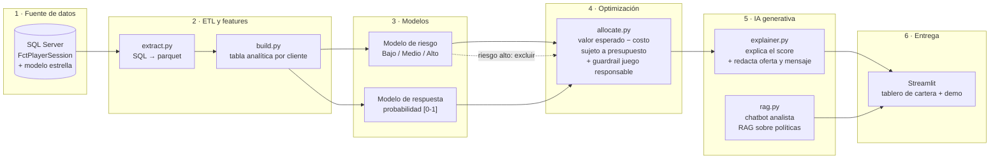

# Identificación de riesgos y optimización de recompensas — Casino Palacio Real

> Proyecto Integrador · Diploma AI Engineer (DMC Institute) · 2026
> Caso de estudio con datos **simulados**.

Solución basada en **Machine Learning e IA generativa** que identifica el **nivel de
riesgo** de cada cliente y estima su **probabilidad de respuesta** a una recompensa,
para **optimizar la asignación del presupuesto promocional** de Casino Palacio Real,
respetando salvaguardas de **juego responsable**.

## Objetivo (SMART)

Desarrollar, sobre el histórico de sesiones de juego, un sistema que asigne a cada
cliente un nivel de riesgo (Bajo/Medio/Alto) y una probabilidad de respuesta [0–1],
y que a partir de ambos proponga una recompensa por cliente maximizando el retorno
esperado de la campaña sujeto a un presupuesto, superando en retorno esperado a la
asignación por reglas actual.

## Bloques del diploma integrados

| Bloque | Cómo se usa en el proyecto |
|---|---|
| **Recomendación adaptativa / agentes** | Modelos de riesgo y de propensión + optimizador de asignación de recompensas (ranking por valor esperado / knapsack; extensible a *contextual bandits*). |
| **IA generativa (texto)** | Capa LLM que explica los scores en lenguaje natural y redacta la oferta y el mensaje personalizado por cliente. |
| **Chatbot RAG** | Asistente para el analista con RAG sobre la política de recompensas y el protocolo de juego responsable (`rag/politicas/`). |
| Microsoft Azure | *Trabajo futuro* — despliegue en Azure Container Apps + Azure OpenAI + Blob Storage. Documentado en [`docs/arquitectura.md`](docs/arquitectura.md). |

## Arquitectura

Estado contrastado con el código y orden de implementación:
[qué está aplicado y qué falta](docs/estado_arquitectura.md).


```mermaid
flowchart LR
    subgraph Fuente["1 · Fuente de datos"]
        SQL[("SQL Server<br/>FctPlayerSession<br/>+ modelo estrella")]
    end
    subgraph ETL["2 · ETL y features"]
        EXT["extract.py<br/>SQL → parquet"]
        FEAT["build.py<br/>tabla analítica por cliente"]
    end
    subgraph ML["3 · Modelos"]
        RISK["Modelo de riesgo<br/>Bajo / Medio / Alto"]
        RESP["Modelo de respuesta<br/>probabilidad [0-1]"]
    end
    subgraph OPT["4 · Optimización"]
        ALLOC["allocate.py<br/>valor esperado − costo<br/>sujeto a presupuesto<br/>+ guardrail juego responsable"]
    end
    subgraph GEN["5 · IA generativa"]
        EXPL["explainer.py<br/>explica el score<br/>+ redacta oferta y mensaje"]
        RAG["rag.py<br/>chatbot analista<br/>RAG sobre políticas"]
    end
    subgraph APP["6 · Entrega"]
        UI["Streamlit<br/>tablero de cartera + demo"]
    end

    SQL --> EXT --> FEAT
    FEAT --> RISK --> ALLOC
    FEAT --> RESP --> ALLOC
    ALLOC --> EXPL --> UI
    RAG --> UI
    RISK -. "riesgo alto: excluir" .-> ALLOC
```

Detalle completo (componentes, decisiones, alternativas, plan Azure) en
[`docs/arquitectura.md`](docs/arquitectura.md). Diagrama y diseño para un
**entorno real de casino con tráfico masivo** (orquestador, Telegram, colas,
red, logs) en [`docs/arquitectura_produccion.md`](docs/arquitectura_produccion.md).

## Estructura del repositorio

```
.
├── sql/                  Scripts de base de datos (cargar, dimensiones, features)
├── data/
│   ├── raw/              CSV simulado de sesiones (fuente)
│   ├── interim/          extracciones intermedias (git-ignored)
│   └── processed/        tabla analítica lista para modelar (git-ignored)
├── src/casino_ia/
│   ├── config.py         configuración central (lee .env)
│   ├── data/extract.py   extracción desde SQL Server
│   ├── features/build.py construcción de la tabla analítica por cliente
│   ├── models/risk.py    modelo de nivel de riesgo
│   ├── models/response.py modelo de respuesta V1 + V2 (NBO, siguiente mejor oferta)
│   ├── optimization/allocate.py  asignación óptima de recompensas, con motivo trazable
│   ├── genai/explainer.py capa LLM: explicación + generación de oferta
│   ├── genai/rag.py      chatbot RAG (web + Telegram + operador)
│   ├── genai/telegram_bot.py  notifica la oferta y captura la respuesta por Telegram
│   ├── metrics/respuesta_real.py  registro y medición de respuestas reales
│   └── app/streamlit_app.py  tablero, ficha por cliente y chat flotante
├── scripts/              EDA, entrenamiento, asignación, diagrama de producción
├── notebooks/            01_eda.ipynb
├── rag/politicas/        documentos de política (base de conocimiento del RAG)
├── rag/referencia/       guía de asignación, catálogo, FAQ, glosario
├── docs/                 arquitectura.md, arquitectura_produccion.md, modelos.md, datos.md
├── tests/                pruebas de features, asignación, métricas y Telegram
└── reports/              figuras y métricas generadas
```

## Puesta en marcha (< 10 min)

Requisitos: Python 3.11+, SQL Server 2022 con la base `CasinoPalacioReal` cargada
(ver [`sql/README.md`](sql/README.md)), *ODBC Driver 17 for SQL Server*.

```bash
git clone https://github.com/milagrossanchez/proyecto-integrador-ai-engineer.git
cd proyecto-integrador-ai-engineer

python -m venv .venv
# Windows:  .venv\Scripts\activate
# Linux/Mac: source .venv/bin/activate
pip install -r requirements.txt

cp .env.example .env          # y completar credenciales

# 1) EDA
python scripts/run_eda.py
# 2) Entrenar modelos de riesgo y respuesta
python scripts/train_models.py
# 3) Asignación óptima de recompensas para un presupuesto dado
python scripts/run_allocation.py --presupuesto 15000
# 4) Demo interactiva
streamlit run src/casino_ia/app/streamlit_app.py
```

Si no hay conexión a SQL Server, el pipeline usa como *fallback* el CSV de
`data/raw/` y las vistas se replican en pandas.

## Interfaz React y API administrativa

La interfaz React consume una API FastAPI que reutiliza los modelos, features y
guardrails existentes. Streamlit se conserva como demo independiente. Esta
implementación es para uso administrativo local: la API se enlaza a `127.0.0.1`
y no incluye autenticación para exponerla en una red.

Si aún no existen los modelos en `models_store/`, genera primero los artefactos
con `python scripts/train_models.py`. Luego inicia cada proceso en una terminal
distinta, desde la raíz del repositorio.

**Terminal 1 — API**

```powershell
.\.venv\Scripts\Activate.ps1
uvicorn casino_ia.api.main:app --app-dir src --host 127.0.0.1 --port 8000
```

**Terminal 2 — React**

```powershell
cd frontend
npm install
npm run dev
```

Abre `http://localhost:5173/`. La documentación interactiva de la API está en
`http://127.0.0.1:8000/docs`.

## Datos

`data/raw/playersession_ficticio_100k.csv` — 100 000 sesiones simuladas, 888
clientes, 15 días (jul 2026). Deriva de la tabla real `FctPlayerSession` de un
data warehouse de casino; **todos los identificadores y atributos son sintéticos**,
no hay datos personales. Diccionario en [`docs/datos.md`](docs/datos.md).

## Modelos

Descripción detallada de qué hace cada modelo, sus variables, cómo se ajustan
y se evalúan, y un diagrama: [`docs/modelos.md`](docs/modelos.md).

## Estado del proyecto

- [x] Base de datos, modelo estrella y tabla analítica por cliente (SQL)
- [x] EDA y baseline por reglas
- [x] Modelo de riesgo y modelo de respuesta V1, con búsqueda de hiperparámetros (v2)
- [x] Modelo de respuesta V2 / siguiente mejor oferta (NBO), por tipo de recompensa
- [x] Optimizador de asignación de recompensas, con política trazable (`MotivoDecision`)
- [x] Capa de IA generativa integrada (explicación + oferta + chatbot RAG)
- [x] Chatbot como widget flotante en la web (persiste entre pestañas)
- [x] Módulo de Telegram — notificación de la oferta y captura de la respuesta (modo dry-run sin token)
- [x] Medición de la respuesta real (`metrics/respuesta_real.py`) para reemplazar las campañas simuladas
- [x] Arquitectura de producción documentada (orquestador, colas, red, logs) con diagrama
- [x] App de demo (Streamlit)
- [ ] Evaluación completa e informe técnico
- [ ] Despliegue en Azure

## Equipo

| Rol | Integrante |
|---|---|
| Líder / PM | _(completar)_ |
| Data / ML Engineer | _(completar)_ |
| AI / Backend Developer | _(completar)_ |
| UX / Presentación | _(completar)_ |

## Aviso ético

El sistema **no debe incentivar el juego problemático**. Los clientes clasificados
como de riesgo alto se excluyen de las campañas de incentivo y se derivan al
protocolo de juego responsable. La capa de IA generativa aplica *guardrails* que
impiden recomendar mayor estímulo de juego a esos clientes.
