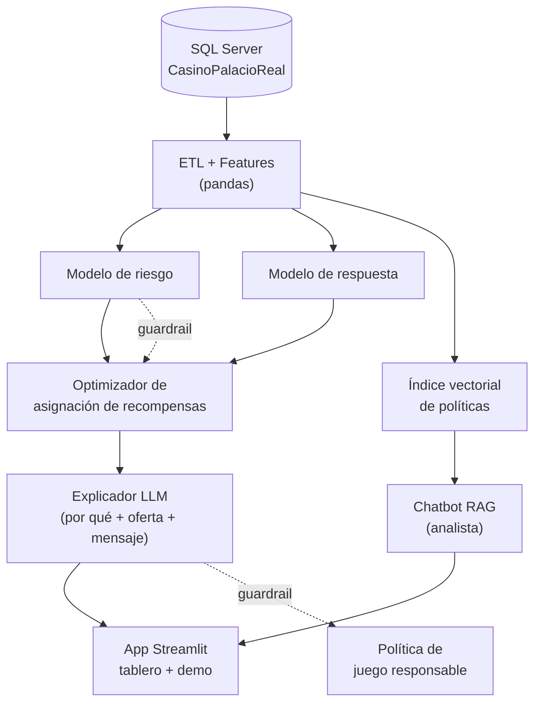
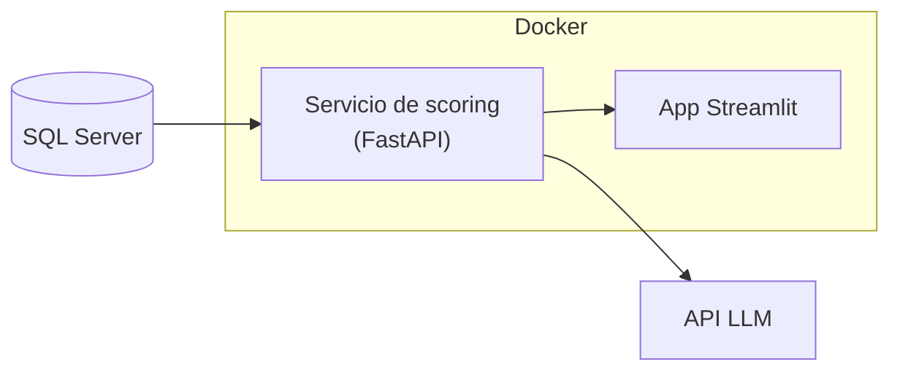

# Arquitectura propuesta

Proyecto Integrador · *Identificación de riesgos y optimización de recompensas — Casino Palacio Real*

Este documento es el entregable de **arquitectura propuesta** del primer seguimiento.
Describe los componentes, el flujo de datos, las decisiones técnicas con su
justificación, las alternativas evaluadas y el plan de despliegue.

---

## 1. Visión general

El sistema toma el histórico de sesiones de juego, construye una **tabla analítica
por cliente**, entrena **dos modelos** (riesgo y respuesta), y con sus salidas un
**optimizador** decide qué recompensa asignar a cada cliente dentro de un
presupuesto. Una **capa de IA generativa** explica cada decisión y redacta la
comunicación; un **chatbot RAG** permite al analista consultar la cartera y las
políticas. Todo se expone en una **app de demo**.



---

## 2. Componentes

### 2.1 Fuente de datos — SQL Server

- Base `CasinoPalacioReal` con la tabla de hechos `FctPlayerSession` (100 000
  sesiones simuladas) y un **modelo estrella** de dimensiones (`DimCliente`,
  `DimMaquina`, `DimSala`, `DimEmpresa`, `DimUbicacion`, `DimMoneda`,
  `DimCalendario`).
- Vistas analíticas: `vw_SesionesDetalle`, `vw_FeaturesCliente` (una fila por
  cliente), `vw_ClientesScoring` (baseline por reglas).
- Scripts reproducibles en [`sql/`](../sql). La lógica de features vive en SQL para
  que sea auditable y reutilizable fuera de Python.

### 2.2 ETL y features — `src/casino_ia/`

- `data/extract.py`: se conecta por **SQLAlchemy + pyodbc** (autenticación de
  Windows) y materializa `vw_FeaturesCliente` y las tablas necesarias a
  **Parquet** en `data/interim/`. *Fallback*: si no hay conexión, lee
  `data/raw/playersession_ficticio_100k.csv` y reconstruye los features en pandas.
- `features/build.py`: normalización, imputación, *encoding* de variables
  categóricas (segmento, ciudad) y separación train/test **temporal**
  (primeros días entrenan, últimos validan). Produce `data/processed/abt_cliente.parquet`.

Grupos de variables (detalle en [`docs/datos.md`](datos.md)):

| Grupo | Ejemplos | Modelo |
|---|---|---|
| Actividad / frecuencia | nº sesiones, días activos, recencia | riesgo + respuesta |
| Valor / monetario | CoinIn total, valor teórico casa, pérdidas, comps | riesgo + respuesta |
| Intensidad de juego | CoinIn por hora, duración de sesión, apuesta máxima | riesgo |
| Patrones de riesgo | % sesiones largas, % juego madrugada, % *chasing*, volatilidad | riesgo |
| Tendencia reciente | CoinIn y sesiones últimos 7 días vs. previo | respuesta |
| Beneficios | comps y puntos acumulados | respuesta |

### 2.3 Modelo de nivel de riesgo — `models/risk.py`

- **Qué produce:** categoría `Bajo / Medio / Alto` + `RiesgoScore` continuo.
- **Enfoque en dos capas:**
  1. *No supervisado / reglas* (prototipo actual): combinación de percentiles de
     las señales de intensidad + detección de anomalías (`IsolationForest`).
     No requiere etiquetas y es explicable.
  2. *Supervisado* (versión final): `GradientBoostingClassifier` /
     LightGBM entrenado con etiquetas de juego responsable + rentabilidad del
     incentivo, cuando exista ese histórico.
- **Uso:** filtro previo a cualquier campaña. Riesgo alto ⇒ excluido del
  optimizador y derivado al protocolo de juego responsable.

### 2.4 Modelo de probabilidad de respuesta — `models/response.py`

- **Qué produce:** probabilidad calibrada `P(respuesta)` ∈ [0, 1] + decil.
- **Enfoque:** clasificación binaria. Baseline `LogisticRegression`;
  modelo principal `GradientBoostingClassifier`. Calibración con
  `CalibratedClassifierCV` (isotónica). Métrica guía: PR-AUC y *lift@decil*.
- **Etiqueta:** en el prototipo, *proxy* de respuesta derivado de la tendencia de
  actividad; en producción, resultado real de campañas (con grupo de control ⇒
  modelo de **uplift**).

### 2.5 Optimizador de asignación de recompensas — `optimization/allocate.py`

- **Función objetivo por cliente y tipo de recompensa r:**

  ```
  valor_esperado(c, r) = P(respuesta | c, r) · uplift_valor(c) − costo(r)
  ```

  `uplift_valor(c)` se estima desde el valor teórico de la casa (`ValorTeoricoCasa`)
  y la tendencia reciente.
- **Restricciones:**
  - Presupuesto total de la campaña (parámetro).
  - `NivelRiesgo == 'Alto'` ⇒ no elegible (guardrail duro).
  - `NivelRiesgo == 'Medio'` ⇒ solo recompensas de costo bajo/medio.
  - Topes por segmento.
- **Método:** ranking por `valor_esperado / costo` y selección tipo *mochila*
  (greedy con corte por presupuesto; formulación LP exacta como extensión).
  **Baseline de comparación:** asignación por reglas de segmento actual.
- **Extensión adaptativa:** *contextual bandit* (Thompson Sampling) para aprender
  en línea qué recompensa funciona mejor por perfil a medida que llegan resultados.

### 2.6 Capa de IA generativa — `genai/explainer.py`

- Entrada: fila de features del cliente + scores + contribuciones del modelo
  (importancia local tipo SHAP) + recompensa asignada.
- Salida (JSON):
  - `explicacion`: por qué el cliente tiene ese nivel de riesgo y esa propensión,
    en lenguaje claro para el analista.
  - `oferta`: recompensa concreta sugerida y su justificación.
  - `mensaje`: comunicación personalizada (canal, asunto, cuerpo).
- **Guardrails:** *prompt* con instrucciones estrictas + verificación posterior;
  si `NivelRiesgo == 'Alto'` no se genera oferta, se genera una nota de derivación
  a juego responsable.
- Modelo: API de Anthropic (`claude-sonnet-5`), configurable por `.env`.

### 2.7 Chatbot RAG para el analista — `genai/rag.py`

- Base de conocimiento: `rag/politicas/` (política de recompensas, protocolo de
  juego responsable) + un resumen de la cartera scoreada.
- *Pipeline*: *chunking* de los documentos → *embeddings* → índice vectorial
  (FAISS local; Azure AI Search en la nube) → recuperación top-k → respuesta del
  LLM anclada al contexto, con cita de la sección de política.
- *Fallback* explícito: si la pregunta no se puede responder con el contexto, el
  bot lo dice y no inventa.

### 2.8 App de demo — `app/streamlit_app.py`

- Tablero de la cartera: distribución de riesgo, deciles de propensión, resultado
  de la asignación vs. baseline, presupuesto usado.
- Ficha por cliente: features, scores, recompensa asignada y textos generados.
- Pestaña de chat con el asistente RAG.

---

## 3. Flujo de datos

```mermaid
sequenceDiagram
    participant SQL as SQL Server
    participant ETL as ETL (pandas)
    participant M as Modelos
    participant OPT as Optimizador
    participant LLM as IA generativa
    participant UI as App

    SQL->>ETL: vw_FeaturesCliente (888 filas)
    ETL->>ETL: limpieza + split temporal
    ETL->>M: abt_cliente.parquet
    M->>M: entrena riesgo y respuesta
    M->>OPT: NivelRiesgo, P(respuesta), ValorTeorico
    OPT->>OPT: maximiza valor esperado ≤ presupuesto
    OPT->>LLM: cliente + scores + recompensa
    LLM->>UI: explicación + oferta + mensaje
    UI->>LLM: pregunta del analista (RAG)
    LLM->>UI: respuesta anclada en políticas
```

---

## 4. Decisiones técnicas y justificación

| Decisión | Justificación | Alternativas evaluadas |
|---|---|---|
| Features en **SQL** (vistas) | Auditables, reutilizables, cerca del dato; el docente puede revisarlas sin ejecutar Python | Todo en pandas (menos transparente); dbt (exceso para el alcance) |
| **Gradient Boosting** para ambos modelos | Buen desempeño en datos tabulares, maneja no linealidades e interacciones, rápido de entrenar | Redes neuronales (datos insuficientes), solo regresión logística (poca capacidad) |
| **Calibración** de la probabilidad de respuesta | El optimizador necesita probabilidades reales, no solo el ranking | Usar el *score* crudo (sesga el valor esperado) |
| Optimización **greedy tipo mochila** | Solución buena en ms, fácil de explicar al jurado | LP/ILP exacto (se deja como extensión), asignación por reglas (es el baseline) |
| **RAG** sobre políticas para el chatbot | Respuestas verificables y ancladas; evita alucinaciones sobre normas internas | *Fine-tuning* (costoso, poco dato), LLM sin contexto (riesgo de inventar políticas) |
| **Streamlit** para la demo | Una demo que el jurado prueba en vivo vale más que slides; rápido de construir | FastAPI + frontend (más tiempo), notebook (no es demo) |
| **Guardrail de juego responsable** como regla dura, no como recomendación del LLM | La ética no puede depender de que el modelo "decida bien" | Confiar solo en el *prompt* (insuficiente) |

---

## 5. Evaluación (resumen)

| Componente | Métricas |
|---|---|
| Riesgo | AUC / F1, recall en clase *Alto*, matriz de confusión; validación con reglas expertas |
| Respuesta | AUC-ROC, PR-AUC, Brier (calibración), *lift* / ganancia, Precision@K |
| Optimización | retorno esperado de la cartera vs. baseline de reglas, uso de presupuesto, cobertura |
| IA generativa | rúbrica de utilidad y fidelidad; % de salidas conformes a política (RAG *groundedness*) |
| Negocio | ROI incremental simulado; nº de clientes de riesgo alto correctamente excluidos |

Partición **temporal**: se entrena con los primeros días y se valida con los
últimos, para no filtrar información del futuro.

---

## 6. Despliegue

### 6.1 Local / demo (etapa actual)

- Entorno virtual + `requirements.txt`.
- SQL Server local; artefactos de modelo versionados como `.joblib`.
- App con `streamlit run`.

### 6.2 Contenedores (entrega final)



- `Dockerfile` multi-stage; `docker-compose` con SQL Server + servicio + app.

### 6.3 Azure (trabajo futuro — bloque 4)

| Local | Azure |
|---|---|
| SQL Server | Azure SQL Database |
| CSV / Parquet | Azure Blob Storage |
| API LLM | Azure OpenAI |
| FAISS | Azure AI Search |
| `streamlit run` | Azure Container Apps |
| `.env` | Azure Key Vault |
| — | Application Insights (monitoreo: nº consultas, latencia, errores) |

---

## 7. Riesgos y mitigación

| Riesgo | Mitigación |
|---|---|
| Datos simulados sin etiquetas reales | *Proxies* + métodos no supervisados; documentar supuestos; validar con perfiles |
| Señales poco realistas (datos uniformes) | Reglas relativas (percentiles); escenarios de estrés |
| Sesgo / equidad en el scoring | No usar atributos sensibles; auditar tasas por segmento |
| Incentivar juego problemático | Guardrail duro de exclusión + derivación; revisión de la capa generativa |
| Alucinaciones del LLM | RAG con cita de política + verificación + *fallback* explícito |
| Costos de API | *Cache* de respuestas; generar solo para clientes elegibles |
