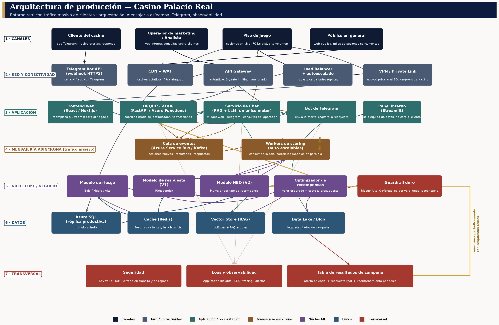

# Arquitectura de producción

El documento [`arquitectura.md`](arquitectura.md) describe el **prototipo**
(lo que corre hoy en una laptop, con Streamlit y SQL Server local). Este
documento describe cómo se vería el mismo sistema en un **entorno real de
casino con tráfico masivo de clientes**: con orquestador, mensajería
asíncrona, Telegram, logs centralizados y las piezas de red que hacen falta
para que aguante carga de verdad.



*(Diagrama completo en `docs/img/arquitectura_produccion.png`. Generado con
`scripts/generar_diagrama_produccion.py`.)*

---

## 1. Qué cambia respecto al prototipo

| Prototipo (hoy) | Producción |
|---|---|
| Streamlit corre en una laptop | **Frontend web (React/Next.js)** detrás de un Load Balancer con autoescalado; Streamlit pasa a ser un **panel interno** del equipo de datos, no la cara del sistema |
| Un script Python llama a los modelos en secuencia | **Orquestador** (FastAPI / Azure Functions) que coordina modelos, optimizador y notificaciones vía API |
| Sin cola: todo es síncrono | **Cola de eventos** (Azure Service Bus / Kafka) + **workers de scoring autoescalables** para absorber el tráfico masivo del piso de juego |
| SQL Server local, sin caché | **Azure SQL** (réplica de lectura) + **Redis** para features de alta frecuencia con baja latencia |
| Sin canal de notificación al cliente | **Bot de Telegram**: envía la oferta y captura la respuesta |
| Chat solo en la pestaña "Asistente" de la web | **Un único servicio de Chat (RAG + LLM)** compartido por el widget flotante de la web, Telegram y las consultas del operador de marketing |
| Sin logs centralizados | **Application Insights / ELK** con tracing de cada request |
| Etiquetas de respuesta simuladas | **Tabla de resultados de campaña real** que alimenta el reentrenamiento periódico |

## 2. El orquestador

Es el componente que faltaba nombrar explícitamente: un servicio (`FastAPI`
o `Azure Functions`) que **no contiene lógica de negocio propia** — coordina:

1. Recibe el evento (nueva sesión, solicitud del frontend, respuesta de
   Telegram) desde la cola o el API Gateway.
2. Llama al modelo de riesgo y al modelo de respuesta/NBO.
3. Llama al optimizador con el resultado.
4. Si hay una recompensa asignada, llama al servicio de Chat para generar la
   explicación/oferta y dispara la notificación (Telegram o web).
5. Registra cada paso en Logs y, si corresponde, en la tabla de resultados.

Vive en la banda 3 del diagrama (`ORQUESTADOR`), entre la capa de red y el
núcleo de modelos — así ningún canal (web, Telegram, operador) llama a los
modelos directamente, todos pasan por el mismo punto de coordinación.

## 3. Por qué Streamlit no es la app de producción

Streamlit es excelente para el prototipo (rápido de construir, ideal para
demo), pero no está pensado para tráfico de clientes concurrente ni para una
experiencia de cliente final: no tiene control fino de autenticación por
usuario, no escala horizontalmente igual que una SPA detrás de un CDN, y cada
sesión de usuario mantiene su propio proceso Python en el servidor.

**Reemplazo:** un **frontend React/Next.js** (o similar) que llama al
orquestador por API REST/GraphQL, servido desde un CDN, detrás de un Load
Balancer con autoescalado. **Streamlit se conserva como panel interno**
(banda 3, "Panel interno") para el equipo de datos — sigue siendo la
herramienta correcta para *ese* uso, no para el cliente final ni el operador
bajo carga alta.

## 4. Tráfico masivo: cómo no se cae

- **Load Balancer + autoescalado** reparte requests entre réplicas del
  frontend y del orquestador según demanda.
- **Cola de eventos** desacopla la llegada de datos (sesiones del piso de
  juego, en volumen alto y ráfagas) del procesamiento: nadie espera a que el
  modelo corra en tiempo real, se encola y un pool de **workers
  autoescalables** la consume a su ritmo.
- **Cache Redis** evita recalcular features por cada request: las variables
  de un cliente activo se sirven desde memoria, no desde SQL en cada scoring.
- **CDN + WAF** absorbe y filtra tráfico del público general antes de que
  llegue a la aplicación.

## 5. Redes y conectividad

| Componente | Función |
|---|---|
| CDN + WAF | cachea contenido estático, filtra tráfico malicioso antes del API |
| API Gateway | punto único de entrada, autenticación, *rate limiting*, versionado de API |
| Load Balancer | reparte tráfico entre réplicas, autoescala según carga |
| VPN / Private Link | conecta de forma privada con el SQL on-prem del casino, sin exponerlo a Internet |
| Telegram Bot API (webhook HTTPS) | canal cifrado dedicado para el tráfico de Telegram, separado del tráfico web |
| Key Vault | credenciales y secretos (token de Telegram, API key del LLM, cadena de conexión) nunca en código ni en `.env` en producción |

## 6. Telegram: notificación de la recompensa y captura de la respuesta

Implementado como prototipo funcional (modo *dry-run* sin credenciales) en
[`src/casino_ia/genai/telegram_bot.py`](../src/casino_ia/genai/telegram_bot.py):

- **`enviar_oferta(chat_id, ficha)`** — el orquestador la llama cuando el
  optimizador asignó una recompensa. Envía el mensaje (generado por
  `genai.explainer`, el mismo texto que se ve en la web) con dos botones:
  *"Sí, me interesa"* / *"No, gracias"*. Registra el evento como **pendiente**
  en la tabla de resultados.
- **`procesar_actualizacion(update)`** — la llama el webhook por cada evento
  de Telegram:
  - **Botón tocado** → respuesta estructurada, cierra el evento pendiente con
    el desenlace real (sí/no).
  - **Texto libre** → se delega al mismo `AsistentePoliticas` (RAG) del
    widget web. El cliente puede preguntar algo en vez de solo aceptar o
    rechazar, y el operador de marketing puede usar el mismo bot para
    consultar sobre un cliente puntual.

Sin `TELEGRAM_BOT_TOKEN`, el módulo arma los mensajes y los loguea sin llamar
a la API real — se puede probar y demostrar sin depender de un bot desplegado
(ver `tests/test_telegram_bot.py`).

## 7. El chatbot: un único motor, tres puntos de entrada

No son tres chatbots — es **un solo servicio de Chat (RAG + LLM)** con tres
formas de llegar a él:

```
                     ┌────────────────────────────┐
  Widget web ───────▶│                            │
  (esquina, flotante,│   Servicio de Chat         │──▶ RAG sobre políticas,
   persiste entre    │   (genai.rag.Asistente-    │    guías y catálogo
   pestañas) ────────▶│   Politicas)               │    (rag/politicas/ +
                     │                            │    rag/referencia/)
  Telegram ──────────▶│                            │
  (cliente o operador)└────────────────────────────┘
```

- **Widget web**: implementado en `src/casino_ia/app/streamlit_app.py` como
  una burbuja fija (`position: fixed`) fuera de las pestañas — el historial
  de conversación se mantiene en `st.session_state`, así que **no se pierde
  al cambiar entre "Cartera" y "Cliente"**.
- **Telegram**: mismo motor, vía `telegram_bot.procesar_actualizacion`.
- **Operador de marketing**: usa el mismo widget o el mismo bot para
  preguntas genéricas sobre uno o varios clientes ("¿cuántos clientes VIP
  están en riesgo medio?", "¿qué le ofrecimos al cliente 900123 la semana
  pasada?") — el RAG se extiende con un resumen tabular de la cartera además
  de los documentos de política (ver [`arquitectura.md`](arquitectura.md#28-chatbot-rag-para-el-analista--genairagpy)).

## 8. Cómo se mide la respuesta del cliente

Esto es lo que permite reemplazar, con el tiempo, las campañas
**semi-sintéticas** de `simular_historico_campanas()` por datos reales —
sin cambiar el resto del pipeline, porque la tabla de resultados usa **el
mismo esquema de columnas** que ya consume `ModeloRespuestaNBO.fit()`.

Implementado en
[`src/casino_ia/metrics/respuesta_real.py`](../src/casino_ia/metrics/respuesta_real.py):

**Esquema de la tabla `FactResultadoCampana`** (Parquet en el prototipo, SQL
en producción):

| Columna | Qué guarda |
|---|---|
| `IdEvento`, `IdCampana`, `IdCliente` | identificación del envío |
| `Canal` | `telegram` / `web` / `otro` |
| `TipoRecompensa`, `NivelRiesgo` | qué se ofreció y con qué riesgo |
| `ProbRespuestaPredicha`, `ValorIncrementalPredicho` | lo que dijo el modelo **antes** de enviar la oferta |
| `FechaOferta`, `FechaRespuesta` | para medir tiempo de respuesta |
| `Respondio`, `ValorGenerado` | el desenlace real |

**Métricas recomendadas** (`calcular_metricas_respuesta()`):

1. **Tasa de respuesta global** y **por canal** (Telegram vs. web) — ¿por
   dónde responde más la gente?
2. **Tasa de respuesta por tipo de recompensa** — ¿la recompensa alta
   realmente convierte más que la baja?
3. **Tiempo de respuesta promedio** — para calibrar cuánto esperar antes de
   cerrar un evento como "no respondió".
4. **Error de calibración real**: se agrupan los eventos por la probabilidad
   que predijo el modelo y se compara contra la tasa real observada en cada
   grupo — esto es lo que responde *"¿el modelo predice bien en la vida
   real, no solo en el holdout simulado?"*.
5. **Valor generado total** vs. costo de las recompensas — el ROI real de la
   campaña, para comparar contra la estimación del optimizador.

Con volumen suficiente (recomendado: mínimo ~30 respuestas por celda
canal × tipo de recompensa para que la tasa sea estadísticamente estable),
esta tabla reemplaza a `simular_historico_campanas()` y el modelo NBO se
reentrena con el patrón de conducta real de los clientes, no con la afinidad
simulada.

## 9. Observabilidad

- **Logs y tracing**: cada llamada al orquestador, a los modelos y al chat
  queda registrada (Application Insights o el stack ELK), con un
  `trace_id` que permite seguir una sola decisión de punta a punta —
  desde que llega el evento del piso de juego hasta que el cliente responde
  por Telegram.
- **Alertas**: sobre errores del pipeline, latencia del orquestador, y sobre
  el *drift* de las métricas de calibración de la sección 8 (si el error de
  calibración empieza a subir, es señal de que el modelo necesita
  reentrenarse).

## 10. Seguridad

- Credenciales (token de Telegram, API key del LLM, cadena SQL) en **Key
  Vault**, nunca hardcodeadas ni en `.env` en producción.
- Cifrado en tránsito (HTTPS/TLS en todos los canales) y en reposo (SQL,
  Blob).
- El webhook de Telegram valida un secreto (`TELEGRAM_WEBHOOK_SECRET`) para
  confirmar que la llamada viene de Telegram y no de un tercero.
- El guardrail de juego responsable (riesgo Alto → cero ofertas) se aplica
  en el optimizador, antes de que cualquier canal (web o Telegram) tenga
  oportunidad de notificar — no es una regla de la interfaz, es una regla del
  núcleo del sistema.
