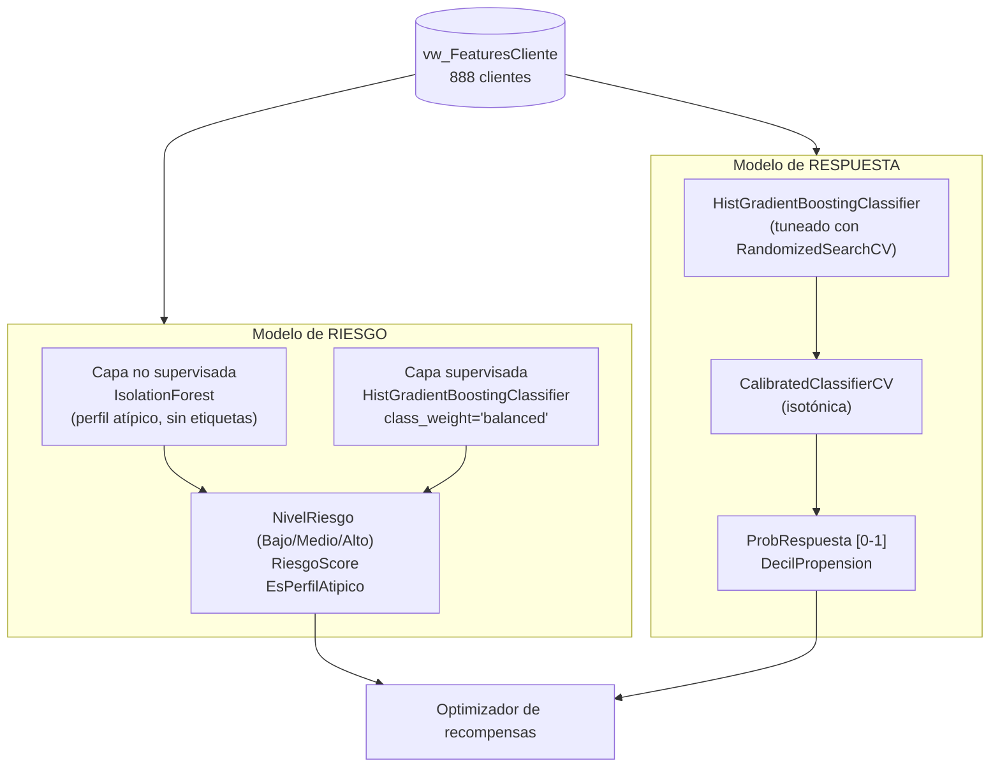

# Los modelos — qué hace cada uno y cómo se construyó

Este documento describe en detalle los dos modelos de Machine Learning del
sistema: **riesgo** y **respuesta**. Complementa a [`arquitectura.md`](arquitectura.md)
(donde viven dentro del pipeline completo) y a [`datos.md`](datos.md) (de dónde
salen sus variables de entrada).

## Diagrama — de la tabla analítica a los dos modelos

---

## 1. Modelo de riesgo

**Pregunta que responde:** ¿qué tan probable es que este cliente muestre un
patrón de juego que amerite cautela (juego no responsable y/o baja
rentabilidad del incentivo)? Salida: `Bajo`, `Medio` o `Alto`.

### 1.1 Por qué dos capas

| Capa | Algoritmo | Por qué |
|---|---|---|
| No supervisada | `IsolationForest` | No necesita etiquetas: aísla perfiles cuyo patrón de variables se aleja del resto. Sirve de doble chequeo y para detectar casos nuevos que ningún percentil anticipó. |
| Supervisada | `HistGradientBoostingClassifier` | Aprende a **generalizar** la etiqueta de riesgo (hoy un proxy por percentiles, ver más abajo) a partir de las variables de comportamiento, para poder clasificar clientes nuevos sin recalcular percentiles cada vez. |

### 1.2 Variables de entrada (10)

`CoinInPorHora`, `DuracionMaximaMin`, `DuracionPromedioMin`,
`PctSesionesLargas`, `PctJuegoMadrugada`, `PctSesionesChasing`,
`VolatilidadResultado`, `ApuestaMaxima`, `ApuestaMediaPromedio`,
`PerdidasAcumuladas` — todas señales de intensidad/patrón de juego, sin datos
demográficos ni de identidad (evita sesgos por esos atributos).

### 1.3 La etiqueta (proxy) y por qué es una pirámide

No existen marcas reales de juego responsable en la muestra simulada. Se
construye una etiqueta débil (`features/build.py::agregar_scoring_reglas`):
se promedian los percentiles de las 6 señales más asociadas a riesgo y se
cortan en **Bajo (70%) / Medio (22%) / Alto (8%)** — una pirámide, no tercios
iguales, porque en una cartera real la mayoría de los clientes no son de
riesgo y solo una minoría lo es.

### 1.4 Ajuste de hiperparámetros

`RandomizedSearchCV` (25 combinaciones, `StratifiedKFold` de 5 particiones,
métrica `f1_macro`) sobre: `max_iter`, `max_depth`, `learning_rate`,
`l2_regularization`, `min_samples_leaf`. Se usa `class_weight='balanced'`
porque la clase `Alto` es minoritaria (~8%) y sin ponderar el modelo tiende a
ignorarla.

### 1.5 Cómo se evalúa

- **Partición de validación (holdout)** separada de la búsqueda de
  hiperparámetros (20% de los clientes, nunca vistos durante el ajuste).
- **F1 macro** (promedia el desempeño de las 3 clases por igual, para que la
  clase minoritaria `Alto` —la más importante para el negocio— no quede
  invisibilizada por la clase mayoritaria `Bajo`).
- **Matriz de confusión** en el holdout.
- **Importancia por permutación** (no la importancia por *split* del árbol):
  mide cuánto empeora el modelo si se mezcla al azar cada variable —
  refleja mejor el aporte real de cada señal.

### 1.6 Cómo se usa aguas abajo

`NivelRiesgo = Alto` → el cliente queda **excluido** del optimizador de
recompensas y se deriva al protocolo de juego responsable (regla dura, no
depende del modelo). `Medio` → solo recompensas de costo bajo/medio.

---

## 2. Modelo de respuesta (propensión)

**Pregunta que responde:** ¿qué probabilidad hay de que este cliente
reaccione positivamente si recibe una recompensa? Salida: un número entre 0 y
1, más un decil (1 = menos propenso, 10 = más propenso).

### 2.1 Por qué "calibrado"

Un clasificador normal da un *score* que ordena bien a los clientes pero no es
una probabilidad real (un 0,8 no necesariamente significa 80% de chance). El
optimizador de recompensas usa ese número **directamente en una fórmula de
valor esperado**, así que necesita ser una probabilidad de verdad. Por eso el
mejor modelo de la búsqueda se envuelve en `CalibratedClassifierCV` (método
isotónico), que ajusta la salida para que sea consistente con la frecuencia
real observada.

### 2.2 Variables de entrada (11) y por qué se excluyen otras

`DiasDesdeUltimaSesion`, `NroSesiones`, `DiasActivos`, `CoinInTotal`,
`CoinInPromedioSesion`, `ValorTeoricoCasa`, `CompsAcumulados`,
`PuntosAcumulados`, `ApuestaMediaPromedio`, `HorasJugadas`, `AntiguedadDias`.

Se excluyen a propósito `CoinIn_Ultimos7d`, `CoinIn_Previo` y
`RatioTendenciaCoinIn`: son la base de la etiqueta (ver 2.3), así que usarlas
como *feature* sería fuga de información (el modelo "haría trampa" mirando la
respuesta antes de predecirla).

### 2.3 La etiqueta (proxy): "momentum positivo"

Sin histórico real de campañas, se define una etiqueta observable: el gasto
del cliente en los **últimos 7 días** frente a lo esperable si su ritmo fuera
constante en toda la ventana de 15 días (`ratio ≥ 7/8`). Es una aproximación
razonable a "cliente activo/creciente", pero en producción se reemplaza por el
resultado real de una campaña con grupo de control.

### 2.4 Ajuste de hiperparámetros

Igual mecánica que en el modelo de riesgo, pero con **`average_precision`
(PR-AUC)** como métrica de búsqueda en vez de ROC-AUC: con una tasa de
positivos del ~62% y el objetivo de priorizar bien a los candidatos "top", la
PR-AUC es más informativa que el ROC-AUC.

### 2.5 Cómo se evalúa

| Métrica | Qué mide |
|---|---|
| ROC-AUC | capacidad general de ordenar respondedores vs. no respondedores |
| PR-AUC | igual, pero más sensible al desbalance de clases |
| Brier score | qué tan calibradas están las probabilidades (más bajo = mejor) |
| Lift del decil superior | cuántas veces más responden los del decil 10 frente al promedio |
| **Comparación contra baseline** | el mismo holdout evaluado con una regresión logística simple — el modelo tuneado debe superarla |

En la corrida más reciente el modelo tuneado superó claramente al baseline
logístico en ambas métricas de ranking (ver `reports/metrics/metrics_modelos.json`
para los números exactos de la última ejecución).

### 2.6 Cómo se usa aguas abajo

`ProbRespuesta` entra directo a la fórmula del optimizador:
`valor_esperado = ProbRespuesta × valor_incremental − costo`. Ver
[`arquitectura.md`](arquitectura.md#25-modelo-de-recomendación-siguiente-mejor-oferta--optimizationallocatepy).

---

## 3. Resumen de la mejora respecto a la v1

| | v1 (primer seguimiento) | v2 (esta versión) |
|---|---|---|
| Algoritmo | `GradientBoostingClassifier` con hiperparámetros por defecto | `HistGradientBoostingClassifier` con búsqueda de hiperparámetros (`RandomizedSearchCV`, 25 combinaciones, CV de 5) |
| Desbalance de clases (riesgo) | sin ponderar | `class_weight='balanced'` |
| Validación | solo cross-validation | holdout separado de la búsqueda + cross-validation |
| Importancia de variables | importancia por *split* (sesgada a variables de alta cardinalidad) | importancia por permutación (mide el aporte real) |
| Métrica de búsqueda (respuesta) | no aplicaba | PR-AUC (más adecuada que ROC-AUC aquí) |
| Comparación | ninguna | contra baseline de regresión logística, en el mismo holdout |
| Pirámide de riesgo | tercios iguales (poco realista) | ~70% Bajo / 22% Medio / 8% Alto |

Los números exactos de la corrida vigente están en
`reports/metrics/metrics_modelos.json` (se regenera con
`python scripts/train_models.py`).
